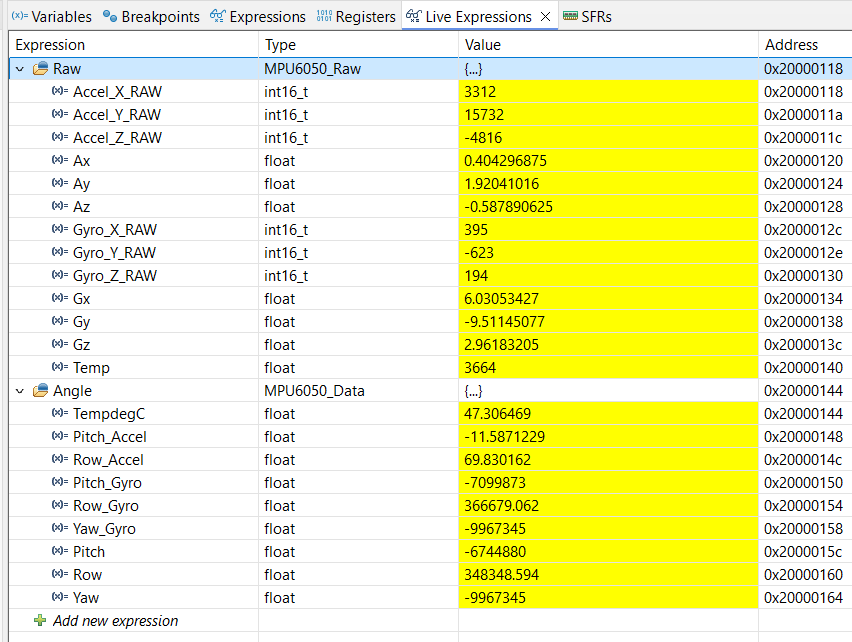
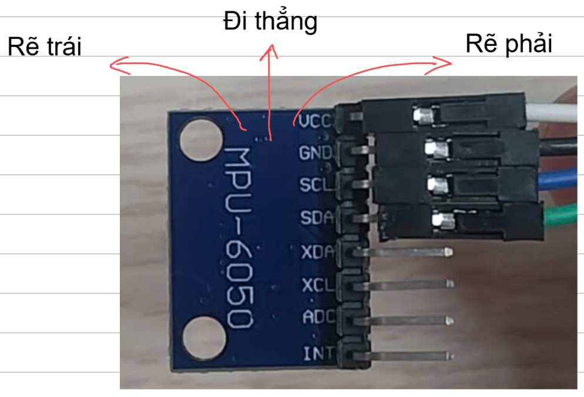
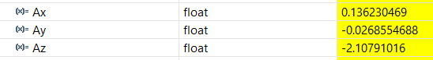

# MPU6050 with IDE Debug

**Reference:** https://kysungheo.com/mpu6050/

## 1. Configure .ioc File

- At I2C1, Enable I2C.
- In TIM1, Clock Source: "Internal Clock".

Therefore, **at Pinout View,**
- PB6: I2C1_SCL
- PB7: I2C1_SDA

## 2. Hardware Connection

|MPU6050|STM32|
|:---:|:---:|
|GND|GND|
|VCC|5V|
|SCL|PB6|
|SDA|PB7|

## 3. C Code

First, we need library:
- `mpu6050.c`
- `mpu6050.h`

In `main.h`:
```cpp
/* USER CODE BEGIN Includes */
#include "mpu6050.h"
/* USER CODE END Includes */
```

Then at `main.c`:
```cpp
/* USER CODE BEGIN 0 */
MPU6050_Raw Raw;
MPU6050_Data Angle;
/* USER CODE END 0 */

/* USER CODE BEGIN 2 */
MPU6050_Init();
HAL_Delay(1000);
/* USER CODE END 2 */

/* USER CODE BEGIN WHILE */
while (1)
{
    MPU6050_Read_Data(&Raw);
    MPU6050_Read_Angle(&Angle);
    HAL_Delay(100);
    /* USER CODE END WHILE */
```

## 4. Solution

> At Debug Perspective,

<p align="center">
    
</p>

**Link Video:** https://mega.nz/file/NAZBjSxI#HeOtCsXYdiXdWaD12sOY--DAzFKcsFWWdjmejeJMR2Q

### 4.4.1. Variable `Angle.Yaw`

The most important things we need is the variable `Angle.Yaw` (or `Angle.Yaw_Gyro` (same thing)).

Coi **MPU6050 nằm ngang** thì:

<p align="center">
    
</p>

- Khi **hướng xe giữ nguyên** (đi thẳng hoặc lùi), `Angle.Yaw` tăng từ từ.
- Khi xe **rẽ phải** (theo chiều kim đồng hồ), `Angle.Yaw` tăng nhanh.
- Khi xe **rẽ trái** (NGƯỢC chiều kim đồng hồ), `Angle.Yaw` giảm nhanh.

**CHÚ Ý:** Giá trị `Angle.Yaw` không cố định!!! Mình chỉ xét sự BIẾN ĐỔI của nó thôi!!!

### 4.4.2. Variable `Raw.Ax`, `Raw.Ay`, `Raw.Az`

Đối với trường hợp **nằm ngang** thì **bất kể hướng nào** [**LƯU Ý: VẪN THEO HÌNH TRÊN**] thì giá trị của `Raw.Ax`, `Raw.Ay`, `Raw.Az` luôn xấp xỉ vậy:

<p align="center">
    
</p>