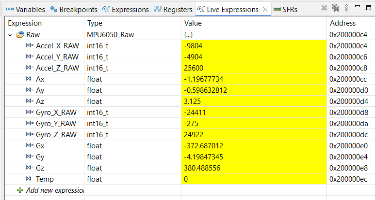

# MPU6050 with IDE Debug

**Reference:** https://kysungheo.com/mpu6050/

## 1. Configure .ioc File

- At I2C1, Enable I2C.
- In TIM1, Clock Source: "Internal Clock".

Therefore, **at Pinout View,**
- PB6: I2C1_SCL
- PB7: I2C1_SDA

## 2. Hardware Connection

|MPU6050|STM32|
|:---:|:---:|
|GND|GND|
|VCC|5V|
|SCL|PB6|
|SDA|PB7|

## 3. C Code

First, we need library:
- `mpu6050.c`
- `mpu6050.h`

Then at `main.c`:
```cpp
/* USER CODE BEGIN 0 */
MPU6050_Raw Raw;
MPU6050_Data Angle;
/* USER CODE END 0 */

/* USER CODE BEGIN 2 */
MPU6050_Init();
HAL_Delay(1000);
/* USER CODE END 2 */

/* USER CODE BEGIN WHILE */
while (1)
{
MPU6050_Read_Data(&Raw);
HAL_Delay(100);
/* USER CODE END WHILE */
```

## 4. Solution

> **At Debug Perspective,**

<p align="center">
    
</p>

**Link:** https://mega.nz/file/NAZBjSxI#HeOtCsXYdiXdWaD12sOY--DAzFKcsFWWdjmejeJMR2Q