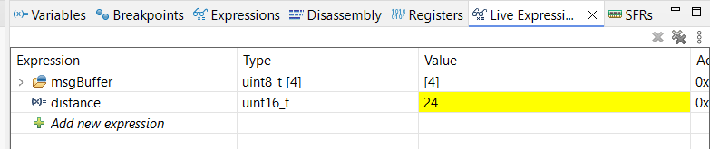
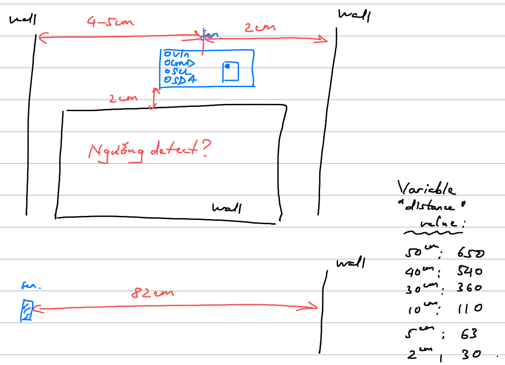

# VL53L0X Time-of-Flight Sensor

Reference: https://github.com/Squieler/VL53L0X---STM32-HAL

## 1. Configure .ioc File

- At I2C2, Enable I2C.

Therefore, **at Pinout View,**
- PB10: I2C1_SCL
- PB11: I2C1_SDA

## 2. Hardware Connection

|MPU6050|STM32|
|:---:|:---:|
|GND|GND|
|VCC|5V|
|SCL|PB10|
|SDA|PB11|

## 3. C Code

Add these 2 files `vl53l0x.h` and `vl53l0x.c`.

In main.h:
```cpp
/* USER CODE BEGIN Includes */
#include "vl53l0x.h"
/* USER CODE END Includes */
```

In `main.c`:
```cpp
/* USER CODE BEGIN Includes */
#include <stdio.h>
/* USER CODE END Includes */

/* USER CODE BEGIN 0 */
uint16_t distance;
/* USER CODE END 0 */

/* USER CODE BEGIN 2 */
// Initialise a message buffer.
char msgBuffer[52];
for (uint8_t i = 0; i < 52; i++) {
    msgBuffer[i] = ' ';
}

// Initialise the VL53L0X
statInfo_t_VL53L0X distanceStr;
initVL53L0X(1, &hi2c2);

// Configure the sensor for high accuracy and speed in 20 cm.
// GIỮ NGUYÊN!!!
setSignalRateLimit(200);
setVcselPulsePeriod(VcselPeriodPreRange, 10);
setVcselPulsePeriod(VcselPeriodFinalRange, 14);
setMeasurementTimingBudget(300 * 1000UL);
/* USER CODE END 2 */

/* USER CODE BEGIN WHILE */
while (1)
{
    // uint16_t distance is the distance in millimeters.
    // statInfo_t_VL53L0X distanceStr is the statistics read from the sensor.
    distance = readRangeSingleMillimeters(&distanceStr);

    sprintf(msgBuffer, "Distance: %d\r\n", distance);
    /* USER CODE END WHILE */
```

## 4. Solution

<p align="center">
    
</p>

Nếu không detect được tường (vì **tường quá xa** so với sensor) thì value của `distance` là 8191.

<p align="center">
    

</p>
